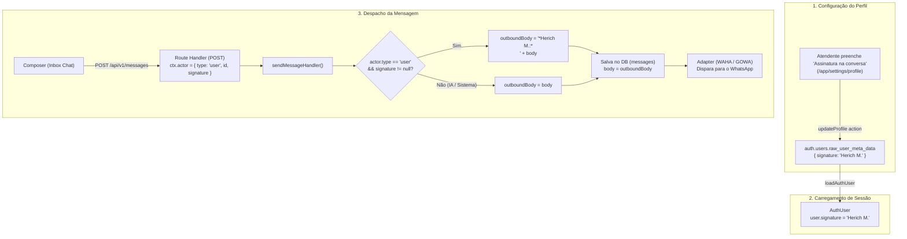

# Arquitetura de Assinatura na Conversa no Perfil do Atendente

> **Status:** Documentação de Arquitetura & Especificação Técnica  
> **Módulos:** Configurações de Perfil (`/app/settings/profile`), Contexto de Usuário (`lib/auth/`), Envio de Mensagens (`app/api/v1/messages/`) e Inbox

---

## 1. Contexto e Motivação

No DeskcommCRM / PLUMA, múltiplos atendentes humanos podem interagir com o mesmo lead/cliente em uma conversa (assumindo, transferindo ou revezando o atendimento).

Para que o cliente final identifique com facilidade qual atendente está respondendo pelo WhatsApp:
- O atendente pode configurar uma **"Assinatura na conversa"** em seu perfil pessoal (ex: `Herich M.`, `Herich - Suporte`, `Dr. Roberto`).
- Toda mensagem de texto ou mídia com legenda enviada **manualmente por esse atendente** recebe automaticamente o prefixo em negrito no padrão WhatsApp:
  ```text
  *{assinatura}:*
  {corpo da mensagem}
  ```
  *Exemplo:*
  ```text
  *Herich Marcelo:*
  Olá! Tudo bem? Como posso te ajudar hoje?
  ```

---

## 2. Regras de Negócio e Comportamento

1. **Configuração Opcional:** O campo é opcional (texto simples de até 100 caracteres). Se vazio, nenhuma assinatura é prefixada.
2. **Exclusividade para Envio Humano:** A assinatura é injetada **apenas** em mensagens enviadas manualmente pelo atendente via interface de chat (`actor.type === "user"`).
3. **Isolamento de IA e Automações:** Mensagens geradas pelo bot/agente de IA (`actor.type === "ai_agent"`) e mensagens disparadas por workers/crons/sistema (`actor.type === "system"`) **nunca** recebem assinatura de atendente.
4. **Isolamento de Notas Internas:** Notas internas de atendimento nunca vão para o WhatsApp e não recebem assinatura de mensagem.
5. **Mídia e Anexos:**
   - Se o arquivo possuir legenda (`caption`/`body`), a assinatura é prefixada na legenda.
   - Se o arquivo for enviado sem texto, o arquivo é enviado sem quebra ou texto artificial.
6. **Modelos de Mensagem (Templates):** Templates oficiais do WhatsApp possuem aprovação estrita de conteúdo na Meta e não sofrem alteração.
7. **Consistência de Histórico:** A mensagem é salva no banco de dados com a assinatura já embutida, garantindo que o que o operador vê no Inbox seja exatamente o que o cliente recebeu no WhatsApp.

---

## 3. Diagrama de Fluxo de Dados



---

## 4. Estrutura de Dados e Contratos

### A. Metadados do Usuário (`AuthUser`)
Em [`lib/auth/types.ts`](file:///c:/Projects/DKCRM/lib/auth/types.ts):
```typescript
export interface AuthUser {
  id: string;
  email: string;
  full_name: string | null;
  avatar_url: string | null;
  is_platform_admin: boolean;
  locale?: string | null;
  timezone?: string | null;
  time_format?: "24h" | "12h" | null;
  signature?: string | null; // Assinatura na conversa
  organizations: UserOrgMembership[];
}
```

### B. Schema de Validação Zod (`profileSchema`)
Em [`lib/schemas/settings.ts`](file:///c:/Projects/DKCRM/lib/schemas/settings.ts):
```typescript
export const profileSchema = z.object({
  full_name: z.string().min(1).max(120).nullable().optional(),
  locale: z.enum(LOCALES),
  timezone: z.string().min(1).max(64),
  time_format: z.enum(TIME_FORMATS).default("24h"),
  signature: z
    .string()
    .max(100)
    .nullable()
    .optional()
    .or(z.literal("").transform(() => null)),
  avatar_url: z.string().url().max(2048).nullable().optional().or(z.literal("").transform(() => null)),
});
```

### C. Contexto do Ator (`Actor` & `HandlerCtx`)
Em [`lib/api/handlers/types.ts`](file:///c:/Projects/DKCRM/lib/api/handlers/types.ts):
```typescript
export type Actor =
  | { type: "user"; id: string; role?: string; signature?: string | null }
  | { type: "ai_agent"; id: string; role: string; api_token_id?: string; agent_id?: string }
  | { type: "webhook_source"; id: string };
```

---

## 5. Componentes e Telas Atualizadas

| Arquivo / Componente | Onde atua | Responsabilidade |
|---|---|---|
| [`app/app/settings/profile/_form.tsx`](file:///c:/Projects/DKCRM/app/app/settings/profile/_form.tsx) | Tela de Perfil | Campo `Input` "Assinatura na conversa" com texto de ajuda e estado reativo |
| [`app/app/settings/profile/page.tsx`](file:///c:/Projects/DKCRM/app/app/settings/profile/page.tsx) | Server Page | Passa `initialSignature={user.signature}` ao formulário |
| [`app/actions/settings/updateProfile.ts`](file:///c:/Projects/DKCRM/app/actions/settings/updateProfile.ts) | Server Action | Persiste `signature` em `auth.users.raw_user_meta_data` e registra auditoria |
| [`app/api/v1/messages/route.ts`](file:///c:/Projects/DKCRM/app/api/v1/messages/route.ts) | Endpoint REST | Injeta `signature: user.signature` no contexto do `actor` |
| [`app/api/v1/messages/_handler.ts`](file:///c:/Projects/DKCRM/app/api/v1/messages/_handler.ts) | Core Handler | Prefixação automática `*${sig}:*\n${body}` antes de gravar e despachar |

---

## 6. Governança e Testes

- **`tests/unit/settings-schema.test.ts`**: Validação do campo `signature` no `profileSchema` (aceita texto até 100 caracteres, normaliza `""` para `null`, e recusa textos maiores que 100 caracteres).
- **`tests/unit/send-message-signature.test.ts`**: Valida a injeção do prefixo apenas quando `actor.type === "user"` e `signature` existe, garantindo que envios de IA e notas internas continuem sem assinatura.
