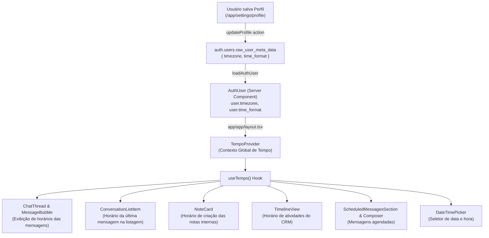

# Arquitetura de Fuso Horário e Formato de Hora (24h / 12h AM-PM)

> **Status:** Documentação de Arquitetura & Especificação Técnica  
> **Módulos:** Configurações de Perfil (`/app/settings/profile`), Contexto Global de Tempo (`lib/tempo/`), Inbox & CRM

---

## 1. Contexto e Motivação

No DeskcommCRM, atendentes e operadores interagem com clientes em múltiplos estados e fusos horários do Brasil e da América Latina (por exemplo, Mato Grosso do Sul no fuso `America/Campo_Grande` UTC-04:00, São Paulo no fuso `America/Sao_Paulo` UTC-03:00, Manaus UTC-04:00, Acre UTC-05:00).

Além disso, diferentes usuários possuem preferências culturais e operacionais quanto à exibição de horários:
* **Formato 24 horas:** Padrão comercial brasileiro (ex.: `14:30`, `08:00`, `22:15`);
* **Formato 12 horas (AM/PM):** Padrão internacional / amigável (ex.: `02:30 PM`, `08:00 AM`, `10:15 PM`).

### Objetivos Principais
1. **Suporte Completo a Fusos Regionais:** Adicionar `America/Campo_Grande` e demais fusos oficiais brasileiros/regionais à lista canônica de fusos oferecidos no sistema ([`lib/tempo/fusos.ts`](file:///c:/Projects/DKCRM/lib/tempo/fusos.ts)).
2. **Preferência de Formato de Hora no Perfil:** Permitir a escolha entre `24h` e `12h (AM/PM)` na tela de Perfil do usuário ([`app/app/settings/profile/_form.tsx`](file:///c:/Projects/DKCRM/app/app/settings/profile/_form.tsx)).
3. **Propagação e Consistência Global:** Garantir que o fuso e o formato escolhidos sejam propagados sem atrito para todas as telas (chat/inbox, notas, timeline de leads, demandas, mensagens agendadas e listagens de conversas).

---

## 2. Decisões de Arquitetura

### A. Desacoplamento Arquitetural (Padrão `IdiomaProvider`)
Seguindo a lição aprendida documentada em [`lib/i18n/IdiomaProvider.tsx`](file:///c:/Projects/DKCRM/lib/i18n/IdiomaProvider.tsx):
* **Não acoplar formatação de hora à autenticação:** Funções de formatação são de camada de apresentação. Se dependessem do `AuthProvider`, dezenas de testes unitários com mocks de auth falhariam ou exigiriam mocks duplicados.
* **Provedor Independente `TempoProvider`:**
  * Vive em `lib/tempo/TempoProvider.tsx`;
  * Recebe `timezone` e `timeFormat` do layout raiz autenticado ([`app/app/layout.tsx`](file:///c:/Projects/DKCRM/app/app/layout.tsx));
  * Fornece hooks reativos `useTempo()` / `useTimeFormat()`;
  * **Fallback Seguro & Silencioso:** Fora da árvore de componentes (ex.: em testes unitários, SSR inicial ou renderizadores isolados), as funções caem graciosamente no padrão seguro (`America/Sao_Paulo` e `24h`), sem lançar exceções.

### B. Persistência de Dados
* As preferências de fuso e formato são armazenadas em `auth.users.raw_user_meta_data`:
  * `timezone`: String IANA validada (ex.: `"America/Campo_Grande"`, `"America/Sao_Paulo"`, `"America/Manaus"`);
  * `time_format`: `"24h" | "12h"`.
* Atualizadas via Server Action [`app/actions/settings/updateProfile.ts`](file:///c:/Projects/DKCRM/app/actions/settings/updateProfile.ts) com validação de schema Zod em [`lib/schemas/settings.ts`](file:///c:/Projects/DKCRM/lib/schemas/settings.ts).
* Carregadas na inicialização da sessão em [`lib/auth/server.ts`](file:///c:/Projects/DKCRM/lib/auth/server.ts) (`loadAuthUser()`) e expostas no tipo `AuthUser`.

---

## 3. Fluxo de Dados e Propagação



---

## 4. Contratos de Tipos e Interfaces

### A. Lista Canônica de Fusos (`lib/tempo/fusos.ts`)
```typescript
export const FUSOS_OFERECIDOS: { codigo: string; rotulo: string }[] = [
  // Brasil
  { codigo: "America/Sao_Paulo", rotulo: "São Paulo (Brasil) — UTC-3" },
  { codigo: "America/Campo_Grande", rotulo: "Campo Grande (Brasil) — UTC-4" },
  { codigo: "America/Cuiaba", rotulo: "Cuiabá (Brasil) — UTC-4" },
  { codigo: "America/Manaus", rotulo: "Manaus (Brasil) — UTC-4" },
  { codigo: "America/Porto_Velho", rotulo: "Porto Velho (Brasil) — UTC-4" },
  { codigo: "America/Boa_Vista", rotulo: "Boa Vista (Brasil) — UTC-4" },
  { codigo: "America/Rio_Branco", rotulo: "Rio Branco (Brasil) — UTC-5" },
  { codigo: "America/Belem", rotulo: "Belém (Brasil) — UTC-3" },
  { codigo: "America/Recife", rotulo: "Recife (Brasil) — UTC-3" },
  { codigo: "America/Fortaleza", rotulo: "Fortaleza (Brasil) — UTC-3" },
  { codigo: "America/Maceio", rotulo: "Maceió (Brasil) — UTC-3" },
  { codigo: "America/Bahia", rotulo: "Bahia (Brasil) — UTC-3" },
  { codigo: "America/Noronha", rotulo: "Fernando de Noronha (Brasil) — UTC-2" },
  // América Latina & Global
  { codigo: "America/Asuncion", rotulo: "Assunção (Paraguai)" },
  { codigo: "America/Argentina/Buenos_Aires", rotulo: "Buenos Aires (Argentina)" },
  { codigo: "America/Montevideo", rotulo: "Montevidéu (Uruguai)" },
  { codigo: "America/Santiago", rotulo: "Santiago (Chile)" },
  { codigo: "America/La_Paz", rotulo: "La Paz (Bolívia)" },
  { codigo: "America/Lima", rotulo: "Lima (Peru)" },
  { codigo: "America/Bogota", rotulo: "Bogotá (Colômbia)" },
  { codigo: "America/Mexico_City", rotulo: "Cidade do México (México)" },
  { codigo: "UTC", rotulo: "UTC" },
];
```

### B. Módulo de Formatação Pura (`lib/tempo/formato.ts`)
```typescript
export type FormatoHora = "24h" | "12h";

export interface OpcoesFormatacaoTempo {
  timezone?: string | null;
  timeFormat?: FormatoHora | null;
  locale?: string | null;
}

/** Formata hora pura: "14:30" (24h) ou "02:30 PM" (12h) no fuso indicado. */
export function formatarHora(
  data: Date | string | number,
  opcoes?: OpcoesFormatacaoTempo,
): string;

/** Formata data e hora: "02/09/2026 14:30" (24h) ou "02/09/2026 02:30 PM" (12h). */
export function formatarDataHora(
  data: Date | string | number,
  opcoes?: OpcoesFormatacaoTempo,
): string;
```

### C. Contexto React (`lib/tempo/TempoProvider.tsx`)
```typescript
export interface TempoContextValue {
  timezone: string;
  timeFormat: FormatoHora;
  is12h: boolean;
  formatarHora: (data: Date | string | number) => string;
  formatarDataHora: (data: Date | string | number) => string;
}
```

---

## 5. Casos de Borda e Defesas do Sistema

1. **Horário de Verão e Mudanças Dinâmicas de Fuso:**  
   O runtime utiliza `Intl.DateTimeFormat` com suporte à base IANA do V8/Node.js, garantindo conversão precisa de offsets sem cálculo manual de timestamps.
2. **Usuário com Metadados Antigos (Sem `time_format` gravado):**  
   O validador Zod e o `TempoProvider` normalizam valores ausentes ou nulos para o padrão `"24h"`, preservando total compatibilidade retrógrada.
3. **Formatos de Data nos Disparos de Automação e IA:**  
   Mensagens de saída com tags (`{hora}`, `{data}`) no worker backend utilizam o fuso configurado da organização/contato para garantir que lembretes automáticos reflitam a hora real do cliente.

---

## 6. Governança e Testes

* **Validação de Fuso no Runtime:** `tests/unit/fuso-horario.test.ts` garante que nenhum fuso da lista lance `RangeError` no `Intl`.
* **Validação de Formatação 12h / 24h:** `tests/unit/tempo-formato.test.ts` testa formatação, AM/PM e fuso horário em diferentes fusos (Campo Grande UTC-4 vs São Paulo UTC-3).
* **Validação de Schemas:** `tests/unit/settings-schema.test.ts` valida o `profileSchema`.
