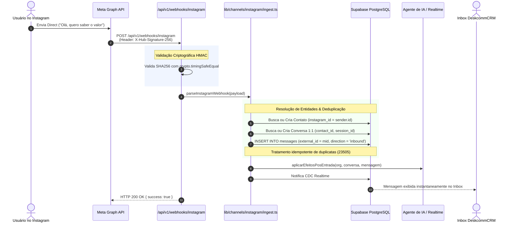

# Arquitetura e Integração Instagram Direct (Meta Graph API)

> **Documento de Arquitetura de Software**  
> **Módulo:** Integração Nativa Instagram Direct via Meta Graph API v22.0  
> **Stack:** Next.js 16 (App Router) · Supabase (PostgreSQL + RLS + Realtime) · Meta Graph API (`graph.facebook.com/v22.0`) · Webhooks com HMAC SHA-256

---

## 1. Arquitetura Geral do Instagram Direct

O **Instagram Direct** é o canal oficial de mensagens do Instagram para Contas Profissionais (Instagram Business e Creator vinculadas a uma Página do Facebook). Ele é integrado diretamente ao DeskcommCRM através da **Meta Graph API v22.0**, seguindo rigorosamente a doutrina de isolamento de canais (`docs/doctrine/restricao-de-canal.md`).

```
┌────────────────────────────────────────────────────────────────────────┐
│                          Meta Cloud Platform                           │
│                                                                        │
│   ┌────────────────────┐                   ┌───────────────────────┐   │
│   │  Instagram Direct  │◄─────────────────►│ Meta Graph API v22.0 │   │
│   │   (App do Usuário) │                   │  (Webhooks + Mensagens)│  │
│   └────────────────────┘                   └───────────┬───────────┘   │
└────────────────────────────────────────────────────────┼───────────────┘
                                                         │ HTTPS (SSL)
                                                         │ /api/v1/webhooks/instagram
                                                         ▼
┌────────────────────────────────────────────────────────────────────────┐
│                              DeskcommCRM                               │
│                                                                        │
│   ┌────────────────────────────────────────────────────────────────┐   │
│   │           Next.js 16 Route Handler (Webhook de Entrada)         │   │
│   │           - Desafio de Verificação (GET hub.challenge)         │   │
│   │           - Validação HMAC SHA-256 (X-Hub-Signature-256)       │   │
│   └────────────────────────────────┬───────────────────────────────┘   │
│                                    │                                   │
│                                    ▼                                   │
│   ┌────────────────────────────────────────────────────────────────┐   │
│   │     Motor de Ingestão (lib/channels/instagram/ingest.ts)       │   │
│   │     - Resolução/Criação de Contato por instagram_id (IGSID)    │   │
│   │     - Vínculo/Criação de Conversa 1:1                          │   │
│   │     - Deduplicação Postgres 23505 (external_id)                │   │
│   │     - Efeitos Pós-Entrada (Agente de IA, Realtime, Webhooks)   │   │
│   └────────────────────────────────┬───────────────────────────────┘   │
│                                    │                                   │
│                                    ▼                                   │
│   ┌────────────────────────────────────────────────────────────────┐   │
│   │                 Supabase Postgres com RLS                      │   │
│   │        [channel_sessions]  [contacts]  [conversations]         │   │
│   └────────────────────────────────────────────────────────────────┘   │
└────────────────────────────────────────────────────────────────────────┘
```

---

## 2. Doutrina de Isolamento & Capacidades Declarativas

A integração do Instagram respeita os princípios de arquitetura de canais do repositório:
- **Zero acoplamento no núcleo do CRM**: Toda a lógica de negócio consome as capacidades do canal a partir da matriz declarativa em [`lib/channels/capabilities.ts`](file:///c:/Projects/DKCRM/lib/channels/capabilities.ts).
- **Classificação de Tipo de Canal (`ChannelKind`)**: `channelKindOf("instagram") === "instagram"`.
- **Validação de Conformidade**: Protegido por `scripts/lint-channels.ts` e suíte de invariantes.

### 2.1 Matriz de Capacidades do Instagram Direct

| Capacidade | Valor | Racional / Comportamento no Sistema |
|---|---|---|
| `canSendMedia` | `true` | Envio de imagens, áudios e vídeos via Meta Graph API. |
| `supportsReaction` | `true` | Suporte a reações com emojis em mensagens. |
| `supportsStatusAck` | `false` | Status de entrega/leitura não bloqueia a esteira de envio. |
| `freeformOutsideWindow` | `false` | **Janela de 24 horas da Meta**: mensagens livres só podem ser enviadas se o usuário interagiu nas últimas 24h. |
| `requiresTemplates` | `false` | Instagram Direct não requer submissão prévia de templates HSM. |
| `banRisk` | `false` | Canal oficial com credenciais autenticadas da Meta Graph API. |

---

## 3. Banco de Dados & Schema (Migration 0174)

A migração [`supabase/migrations/20260904090000_0174_canal_instagram_channel_sessions.sql`](file:///c:/Projects/DKCRM/supabase/migrations/20260904090000_0174_canal_instagram_channel_sessions.sql) adiciona os campos necessários mantendo a integridade referencial:

### 3.1 Alterações em `channel_sessions`
- `instagram_account_id TEXT`: ID da Conta Profissional do Instagram (IGSID).
- `instagram_page_id TEXT`: ID da Página do Facebook associada à conta.
- `instagram_username TEXT`: Handle da conta (`@usuario`).
- `instagram_token_encrypted TEXT`: Token de Acesso da Página (Page Access Token) criptografado com `AES-256-GCM` usando a chave interna `INTERNAL_SECRET`.
- **Constraint de Vocabulário (`channel_sessions_provider_check`)**:
  ```sql
  check (provider = any (array['waha'::text, 'meta_cloud'::text, 'zernio'::text, 'gowa'::text, 'email'::text, 'instagram'::text]))
  ```
- **Constraint de Tagged Union (`channel_sessions_provider_ref_check`)**:
  Garante que sessões do provedor `instagram` possuam obrigatoriamente `instagram_account_id NOT NULL`.
- **Unicidade de Sessão Ativa**:
  ```sql
  create unique index channel_sessions_instagram_account_id_ativo_unique
    on public.channel_sessions (instagram_account_id)
    where archived_at is null and instagram_account_id is not null;
  ```

### 3.2 Alterações em `contacts`
- `instagram_id TEXT`: IGSID único do usuário do Instagram por organização.
- `instagram_username TEXT`: Nome de usuário público do Instagram.
- **Índice de Performance**:
  ```sql
  create index idx_contacts_org_instagram_id
    on public.contacts (organization_id, instagram_id)
    where instagram_id is not null;
  ```

---

## 4. Pipeline de Ingestão de Webhooks (Inbound)

### 4.1 Desafio de Verificação Inicial da Meta (GET Challenge)
A Meta envia uma requisição `GET` para validar o endpoint durante a configuração no painel do desenvolvedor:
```http
GET /api/v1/webhooks/instagram?hub.mode=subscribe&hub.verify_token=meu_token&hub.challenge=1158201444
```
**Resposta do DeskcommCRM:**
- Status: `200 OK`
- `Content-Type: text/plain; charset=utf-8`
- Corpo: O valor bruto de `hub.challenge` (sem envelopes JSON).

### 4.2 Recepção e Ingestão de Mensagens (POST)


---

## 5. Envio de Mensagens (Outbound via Adapter)

O envio de mensagens é orquestrado pelo `InstagramChannelAdapter` ([`lib/channels/adapters/instagram.ts`](file:///c:/Projects/DKCRM/lib/channels/adapters/instagram.ts)):

```mermaid
graph LR
    A[Atendente / Agente IA] -->|POST /api/v1/messages| B[Handler Canônico]
    B -->|resolveRecipient instagramId| C[InstagramChannelAdapter]
    C -->|Descriptografa Token| D[resolveInstagramCreds]
    D -->|POST /v22.0/me/messages| E[Meta Graph API]
    E -->|Entrega Direct| F[Instagram do Cliente]
```



### 5.1 Tratamento de Erros e Janela de 24 Horas
- **Código 10 / Subcódigo 2018278 (Fora da Janela)**: Mapeado como `window_expired` com mensagem amigável para o atendente.
- **Token Expirado ou Revogado (Código 190)**: Mapeado como `auth_failed` e notificado na Central de Conexões.
- **Limite de Taxa (Código 613)**: Mapeado como `rate_limited` com retry exponencial.

---

## 6. Configuração e Testes no Ambiente Local (Localhost)

Como a Meta exige um endpoint público `HTTPS` para envio de Webhooks, utilize um túnel durante o desenvolvimento local.

### 6.1 Passo 1: Iniciar o Túnel
```bash
# Opção 1: Cloudflare Tunnel (Recomendado)
cloudflared tunnel --url http://localhost:3000

# Opção 2: ngrok
ngrok http 3000
```
Copie a URL pública gerada (exemplo: `https://meu-crm-teste.trycloudflare.com`).

### 6.2 Passo 2: Configurar no Meta for Developers
1. Acesse o [Meta for Developers](https://developers.facebook.com/) e selecione seu aplicativo.
2. Adicione os produtos **Instagram** e **Webhooks**.
3. Em **Webhooks > Instagram**:
   - **Callback URL**: `https://meu-crm-teste.trycloudflare.com/api/v1/webhooks/instagram`
   - **Verify Token**: Informe o token configurado no CRM ou no `.env` (`INSTAGRAM_WEBHOOK_VERIFY_TOKEN`).
4. Em **Campos da Inscrição**, selecione:
   - `messages`
   - `messaging_postbacks`
   - `message_deliveries`
   - `messaging_seen`

### 6.3 Passo 3: Conectar no DeskcommCRM
1. Acesse `http://localhost:3000/app/connections`.
2. Clique na aba **Instagram**.
3. Insira o **Token de Acesso da Página**, **ID da Conta do Instagram** e **ID da Página**.
4. Clique em **Salvar e Conectar**. O sistema validará a conectividade com a Graph API e a conta estará pronta para atendimento.
