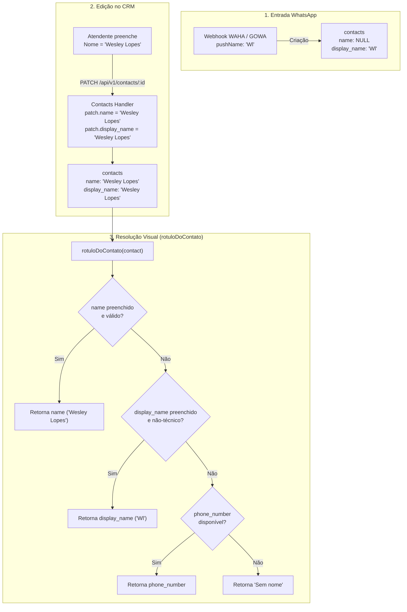

# Arquitetura de Resolução de Nomes: Nome Formal (`name`) vs Display Name (`display_name`)

> **Status:** Documentação de Arquitetura & Especificação de Resolução de Nomes  
> **Módulos:** Contatos (`lib/contacts/`, `app/api/v1/contacts/`), Inbox (`components/inbox/`) e Webhooks (`lib/waha/`, `lib/gowa/`)

---

## 1. Contexto e Conceitos

No DeskcommCRM / PLUMA, cada contato possui dois campos principais de identificação textual:

| Campo | Origem | Propósito / Natureza | Exemplo |
|---|---|---|---|
| `display_name` | **Canal Externo (WhatsApp)** | Nome de exibição público (*pushName* / *notifyName*) configurado pelo próprio cliente no WhatsApp. Pode ser apenas iniciais, apelidos, emojis ou estar incompleto. | `"Wl"`, `"Fabi"`, `"✨ Carol ✨"` |
| `name` | **CRM / Atendente Humano** | Nome formal e verificado do cliente, cadastrado ou editado pela equipe de vendas/suporte no CRM ou vindo de ERP/e-commerce. | `"Wesley Lopes"`, `"Fabiana Silveira"` |

---

## 2. Diagnóstico do Problema

### O Cenário Observado:
1. O cliente entra em contato pelo WhatsApp; o webhook captura o `pushName = "Wl"` e grava `contacts.display_name = "Wl"` com `contacts.name = NULL`.
2. O atendente identifica o cliente e edita o contato no CRM, preenchendo **Nome = "Wesley Lopes"**.
3. **Falha de Exibição:** Na lista de conversas da Inbox, no cabeçalho do chat e no topo da ficha do contato, continuava aparecendo **"Wl"** em vez de **"Wesley Lopes"**.

### Causa Raiz:
1. **Precedência Invertida em `rotuloDoContato`:**
   A função central [`rotuloDoContato`](file:///c:/Projects/DKCRM/lib/contacts/rotulo-do-contato.ts) avaliava:
   ```typescript
   // Comportamento anterior com defeito:
   const candidatos = [c.display_name, c.name];
   ```
   Como `display_name` ("Wl") vinha antes de `name` ("Wesley Lopes"), o apelido do WhatsApp sempre vencia o nome oficial do CRM.

2. **Falta de Sincronização no `PATCH /api/v1/contacts/[id]`:**
   Ao salvar o formulário de edição de contato, o backend atualizava `contacts.name = "Wesley Lopes"`, mas deixava `contacts.display_name = "Wl"` inalterado no banco.

---

## 3. Arquitetura da Solução



---

## 4. Regras de Precedência e Comportamento

1. **Precedência de Exibição:**
   - **1º Prioridade:** `contacts.name` (o nome verificado pelo CRM).
   - **2º Prioridade:** `contacts.display_name` (o apelido/pushName do WhatsApp).
   - **3º Prioridade:** `contacts.phone_number` (o telefone do contato).
   - **4º Fallback:** `SEM_NOME` (`"Sem nome"`).
2. **Filtro de Identificadores Técnicos:**
   - Valores como `Contato 543134@lid`, `551199999999@c.us` ou IDs numéricos puros continuam sendo descartados pelo `ehIdentificadorTecnico()`, evitando poluição de interface e vazamento para o prompt da IA.
3. **Sincronização no Backend:**
   - Ao criar contato com `name` sem `display_name` explícito: `display_name = name`.
   - Ao atualizar `name` no `patchContactHandler`: `patch.display_name = input.name` (salvo se `display_name` for enviado especificamente com outro valor).

---

## 5. Módulos Afetados

| Módulo / Arquivo | Papel na Arquitetura |
|---|---|
| [`lib/contacts/rotulo-do-contato.ts`](file:///c:/Projects/DKCRM/lib/contacts/rotulo-do-contato.ts) | Função canônica universal de resolução de rótulo de contato |
| [`app/api/v1/contacts/_handler.ts`](file:///c:/Projects/DKCRM/app/api/v1/contacts/_handler.ts) | Sincronização automática em `createContactHandler` e `patchContactHandler` |
| [`components/inbox/ConversationListItem.tsx`](file:///c:/Projects/DKCRM/components/inbox/ConversationListItem.tsx) | Lista de conversas do Inbox |
| [`components/inbox/ConversationHeader.tsx`](file:///c:/Projects/DKCRM/components/inbox/ConversationHeader.tsx) | Cabeçalho da conversa aberta |
| [`components/inbox/CRMSidePanel.tsx`](file:///c:/Projects/DKCRM/components/inbox/CRMSidePanel.tsx) | Painel lateral de CRM no Inbox |
| [`components/contacts/ContactsTable.tsx`](file:///c:/Projects/DKCRM/components/contacts/ContactsTable.tsx) | Listagem na tabela `/app/contacts` |
| [`app/app/contacts/[id]/_client.tsx`](file:///c:/Projects/DKCRM/app/app/contacts/[id]/_client.tsx) | Título principal e cabeçalho do dossiê do contato |
