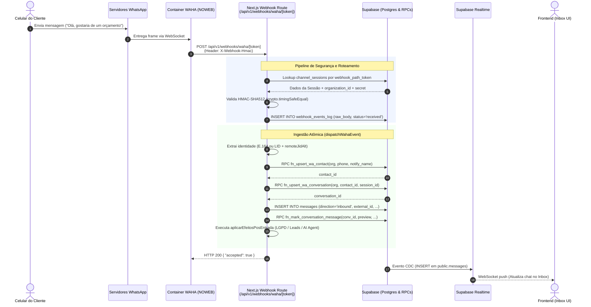

# Arquitetura e Integração WAHA (WhatsApp HTTP API)

> **Documento de Arquitetura de Software**
> **Módulo:** Integração WhatsApp via WAHA (Docker)
> **Stack:** Next.js 16 (App Router) · Supabase (PostgreSQL + RLS + Realtime) · Docker (WAHA Plus / Engine NOWEB)

---

## 1. Arquitetura Geral do WAHA

O **WAHA (WhatsApp HTTP API)** é o serviço responsável por encapsular a comunicação com a rede do WhatsApp, expondo endpoints REST para envio de mensagens/comandos e emitindo webhooks HTTP para notificar eventos em tempo real.

```
┌────────────────────────────────────────────────────────┐
│                   Host VPS / Docker                    │
│                                                        │
│  ┌──────────────────┐            ┌──────────────────┐  │
│  │    WAHA Plus     │  HTTP/REST │   DeskcommCRM    │  │
│  │  (Engine NOWEB)  │◄──────────►│    (Next.js)     │  │
│  │                  │  Webhooks  │                  │  │
│  └────────┬─────────┘            └────────┬─────────┘  │
│           │ /app/.sessions                │            │
│           ▼ (Volume Docker)               ▼            │
│     [Storage Chaves]              [Supabase Postgres]  │
└────────────────────────────────────────────────────────┘
```

### 1.1 WAHA Core vs. WAHA Plus
* **WAHA Core (Open-Source):** Suporta apenas **uma única sessão** (`default`) ativa por container. Não possui suporte nativo a múltiplos webhooks com segredos HMAC por sessão, nem interface visual de gerenciamento de sessões.
* **WAHA Plus (Comercial / Multi-Session):** Permite gerenciar **múltiplas sessões simultâneas** no mesmo container Docker, suporte a engines modernos (`NOWEB`), dashboard visual com Swagger, configuração de webhooks por sessão e assinatura criptográfica dos payloads com HMAC SHA-512. É a versão necessária para arquiteturas multi-tenant.

### 1.2 Conceito de Sessões (`waha_session_name`)
* Cada sessão representa **uma instância de conexão independente com o WhatsApp** (um número de telefone pareado via QR Code).
* Padrão de nomenclatura: `org_<hash>_<sufixo>` (ex: `org_9f81a_vendas`, `org_9f81a_suporte`).
* Cada sessão armazena seus pares de chaves de criptografia Signal e tokens de autenticação persistidos no volume Docker em `/app/.sessions`.

### 1.3 Relação com Containers Docker e Engine `NOWEB`
* **Engine `NOWEB` (Baileys):** O CRM utiliza o engine `NOWEB` (conexão direta via WebSocket puro em Node.js). Diferente de engines baseados em navegador (Chromium/Puppeteer), o `NOWEB` consome **~50MB a 120MB de RAM por sessão** (contra 500MB+ em soluções headless).
* A comunicação entre o Next.js e o container do WAHA é feita pela **rede interna do Docker** (ex: `http://waha:3000`), protegida por `X-Api-Key`.

---

## 2. Fluxo de Entrada (Inbound Webhook)

Quando um cliente envia uma mensagem no WhatsApp para um dos números conectados, o fluxo é processado em dois momentos: **segurança/ingestão no webhook** e **processamento atômico no banco**.

### 2.1 Passo a Passo do Pipeline

1. **Recepção no WAHA:** O cliente envia a mensagem $\rightarrow$ Servidores do WhatsApp entregam no socket do engine `NOWEB` $\rightarrow$ O WAHA identifica a sessão e formata o evento `message`.
2. **Disparo do Webhook:** O WAHA faz um `POST` HTTP para o endpoint dedicado:
   `/api/v1/webhooks/waha/[token]` acompanhado do header `X-Webhook-Hmac: sha512=<hash>`.
3. **Validação e Resolução de Tenant (`app/api/v1/webhooks/waha/[token]/route.ts`):**
   * **Estágio 1 (Roteamento com Zod Loose):** Valida a estrutura básica do JSON (`lerRoteamentoWaha`) sem descartar campos desconhecidos.
   * **Lookup do Tenant:** Busca no banco (`channel_sessions`) pela sessão ativa que possui `webhook_path_token == token`.
   * **Autenticação HMAC SHA-512 (*Fail-Closed*):** O Next.js recupera a chave criptografada da sessão (`webhook_secret_encrypted`), decifra via RPC `fn_decrypt_oauth` e valida a assinatura usando comparação em tempo constante (`crypto.timingSafeEqual`).
   * **Arquivamento Bruto:** Insere o payload e headers em `webhook_events_log` com status `received` para auditoria e rastreabilidade.
   * **Estágio 2 (Contrato de Conteúdo):** Valida a integridade dos campos da mensagem (`conferirContratoWaha`).
4. **Execução do Pipeline (`dispatchWahaEvent` em `lib/waha/ingest.ts`):**
   * **Parse de Identidade:** `parseChatId` processa o identificador do chat:
     * `{number}@c.us` ou `@s.whatsapp.net` $\rightarrow$ Formato telefônico E.164 (`+55...`).
     * `{lid}@lid` $\rightarrow$ Identificador opaco de privacidade do WhatsApp. O CRM extrai o telefone real do campo alternativo `_data.key.remoteJidAlt`.
     * `@g.us` $\rightarrow$ Grupos são ignorados do vínculo de CRM por doutrina de produto.
   * **Upsert Atômico de Contato (`fn_upsert_wa_contact`):** Executa RPC no Supabase que insere ou atualiza o contato sem *race conditions* sob a chave `(organization_id, wa_identity)`.
   * **Upsert Atômico de Conversa (`fn_upsert_wa_conversation`):** Garante a existência da conversa associada ao contato e à `channel_session`.
   * **Persistência da Mensagem:** Grava na tabela `messages` com direção `inbound`, `status: "delivered"` e `external_id` original do WhatsApp.
   * **Idempotência (Postgres `23505`):** Se o evento for reenviado pelo WAHA, a restrição de unicidade `(organization_id, external_id)` captura a duplicação sem duplicar mensagens.
   * **Carimbo Operacional:** A RPC `fn_mark_conversation_message` atualiza a prévia e a data da última mensagem na conversa.
   * **Efeitos Pós-Entrada (`aplicarEfeitosPosEntrada`):** Processa checagem de opt-out LGPD (palavra "SAIR"), criação/qualificação do Lead e despacho para a fila do **Agente de IA** (se ativo na organização).
5. **Propagação em Tempo Real para o Frontend:**
   * O Supabase dispara via **Realtime (Postgres Changes / CDC)** o evento de `INSERT` na tabela `messages` para o WebSocket conectado no navegador do operador.

---

## 3. Diagrama de Sequência — Inbound



---

## 4. Exemplos Reais de JSON

### 4.1 Payload do Webhook Inbound (Recebido do WAHA)

```json
{
  "event": "message",
  "session": "org_7f81a_vendas",
  "engine": "NOWEB",
  "me": {
    "id": "5511999998888@c.us",
    "pushName": "Deskcomm Vendas"
  },
  "payload": {
    "id": "false_5511987654321@c.us_3EB0123456789ABCDEF0",
    "timestamp": 1724553512,
    "from": "5511987654321@c.us",
    "to": "5511999998888@c.us",
    "fromMe": false,
    "body": "Olá! Gostaria de receber a proposta comercial.",
    "hasMedia": false,
    "ack": 1,
    "ackName": "SERVER",
    "_data": {
      "notifyName": "Carlos Eduardo",
      "pushName": "Carlos Eduardo",
      "key": {
        "remoteJid": "5511987654321@c.us",
        "remoteJidAlt": "5511987654321@s.whatsapp.net",
        "fromMe": false,
        "id": "3EB0123456789ABCDEF0"
      },
      "message": {
        "conversation": "Olá! Gostaria de receber a proposta comercial."
      }
    }
  }
}
```

---

## 5. Fluxo de Saída (Outbound)

Quando um operador envia uma mensagem pela interface ou o Agente de IA responde:

1. **Chamada ao Cliente WAHA:** O backend Next.js invoca a classe `WahaClient` (`lib/waha/client.ts`).
2. **Endpoint Invocado:** `POST /api/sendText` (ou `/api/sendMedia` para anexos).
3. **Headers de Autenticação:** `X-Api-Key: <WAHA_API_KEY_HASH>` e `Content-Type: application/json`.
4. **Persistência Local e Rastreio de Status:**
   * A mensagem é persistida na tabela `messages` com `direction: "outbound"` e status inicial `sent`.
   * O WAHA emite webhooks subsequentes com o evento `message.ack` (`ack: 2` = entregue, `ack: 3` = lido), atualizando os status em tempo real.

### 5.1 Payload de Envio Outbound (`POST /api/sendText`)

```json
{
  "session": "org_7f81a_vendas",
  "chatId": "5511987654321@c.us",
  "text": "Olá Carlos! Segue a proposta detalhada conforme solicitado.",
  "reply_to": "false_5511987654321@c.us_3EB0123456789ABCDEF0"
}
```

> **Nota:** O campo `reply_to` utiliza o identificador serializado completo (`{fromMe}_{chatId}_{bareId}`) para que a citação seja renderizada corretamente no aplicativo do destinatário.

---

## 6. Multi-Tenancy e Isolamento de Múltiplos Números

O CRM implementa isolamento multi-tenant rigoroso em todas as camadas:

| Componente | Função no Multi-Tenancy |
| :--- | :--- |
| **`channel_sessions`** | Tabela centralizadora de canais. Armazena `organization_id`, `waha_session_name` (único no container), `status`, `phone_number` e credenciais criptografadas. |
| **`webhook_path_token`** | Token criptográfico aleatório (URL-safe) gerado para cada canal. Compõe a rota `/api/v1/webhooks/waha/[token]`, permitindo lookup direto do tenant sem depender de dados manipuláveis do cliente. |
| **`webhook_secret_encrypted`** | Cada canal possui seu segredo HMAC armazenado de forma criptografada no banco (via `pgcrypto` / `fn_decrypt_oauth`). |
| **RLS (Row Level Security)** | Todas as tabelas (`messages`, `conversations`, `contacts`, `webhook_events_log`) possuem `organization_id` com políticas RLS ativas, impedindo vazamento cross-tenant. |

---

## 7. Riscos Operacionais e Boas Práticas

### 7.1 Risco de Banimento (Protocolo Não Oficial)
* **Comportamento Humano e Jitter:** Evite disparos em massa instantâneos. Insira intervalos randômicos entre mensagens e envie estados de digitação (`/api/startTyping`).
* **Aquecimento de Chip (*Warmup*):** Números novos devem passar por aquecimento gradual de volume ao longo de 2 a 3 semanas antes de receberem tráfego intenso.
* **Proibição de Números Pessoais:** **Nunca conecte números pessoais de colaboradores ou fundadores**. Utilize sempre números corporativos com plano de contingência.
* **Respeito a Opt-Out:** Reconheça palavras-chave de descadastro ("SAIR", "PARAR") para mitigar denúncias de spam.

### 7.2 Otimização de Recursos no Docker
* **Filtro na Fonte (`ignore`):** As sessões são criadas com descarte antecipado de tráfego desnecessário:
  ```json
  "config": {
    "ignore": {
      "status": true,
      "broadcast": true,
      "channels": true,
      "groups": true
    }
  }
  ```
  Isso instrui o WAHA a não processar e nem armazenar status, listas de transmissão e grupos, economizando CPU, rede e volume no banco de dados.
* **Persistência de Sessões:** O diretório `/app/.sessions` deve sempre estar montado em um volume persistente do Docker para evitar perda de pareamento após reinicializações.
* **Limites de Memória:** Embora o engine `NOWEB` seja leve (~100MB por sessão), configure `mem_limit` no Docker Compose para evitar picos sob tráfego severo de mídia.

---

## 8. Sincronização de Fotos de Perfil (Avatares)

* **Consulta Upstream:** `GET /api/contacts/profile-picture?session={session}&contactId={chatId}` via `WahaClient.getProfilePictureUrl()`.
* **Persistência em Bucket Privado:** O link da CDN do WhatsApp expira em ~9 dias (`&oe=...`). O arquivo é baixado e salvo no Supabase Storage no bucket `whatsapp-media` em `{org_id}/avatars/{contact_id}.jpg`.
* **Desacoplamento e LGPD:** A sincronização roda via cron (`app/api/v1/cron/contact-avatars/route.ts`) ou sob demanda. Ao anonimizar o contato por LGPD, o arquivo é removido do storage via `storage_redaction_queue`.
* **Documentação Completa:** Detalhes em [`docs/ARQUITETURA_FOTOS_PERFIL.md`](ARQUITETURA_FOTOS_PERFIL.md).

